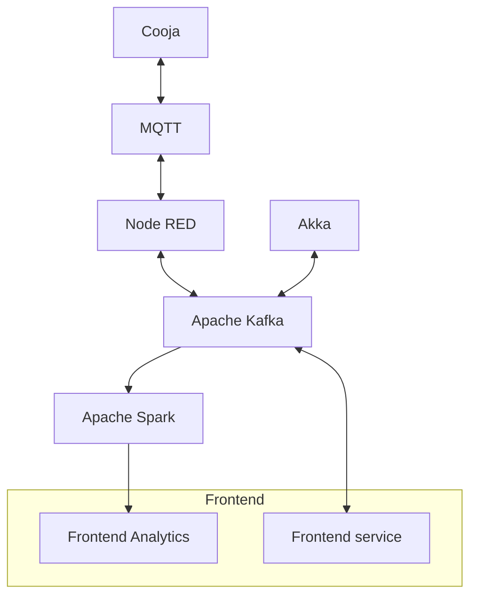

# Networked Software for Distributed Systems Final Project

### Starting the project

First of all, initialize `contiki-ng`:

```bash
git clone --branch release-5.1 --depth 1 https://github.com/contiki-ng/contiki-ng src/smart-grid-iot/contiki-ng
git -C src/smart-grid-iot/contiki-ng submodule update --init tools/cooja
```

If `src/smart-grid-iot/contiki-ng` already exists, remove it before running the two commands above.

Then, install the Node-RED plugins:

```bash
cd infrastructure/nodered/data
npm i
```

Then, start components 1 and 2 with Docker Compose:

```bash
docker compose up -d
```

Wait a few moments for all containers to be created, then open the UI pages:

- Node-RED interface: http://localhost:1880
- Kafka UI frontend: http://localhost:8080
- Frontend dashboard: http://localhost:8501

Important: after startup, wait about 2 minutes for all Cooja nodes to connect to MQTT. If you start too early, the simulation may not work correctly.

Component 3 (MPI simulation) is independent from components 1 and 2.  
To build and run component 3:

```bash
cd src/simulation
cmake -B build
cmake --build build
mpirun -np <N> ./build/sim_mpi
```

Where `<N>` is the number of MPI processes to use.


## Docs

Hereafter, a Mermaid graph with the general structure of elements talking to each other. All of the components are Dockerized and can be distributed; most of the components can be replicated.


